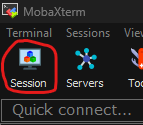
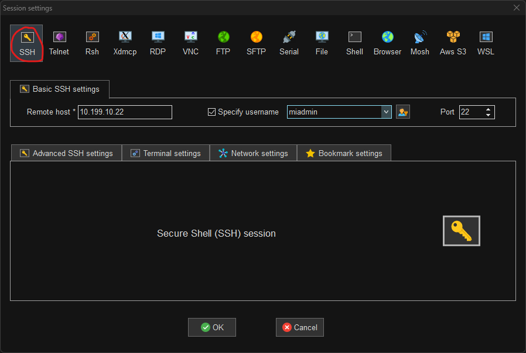
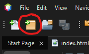
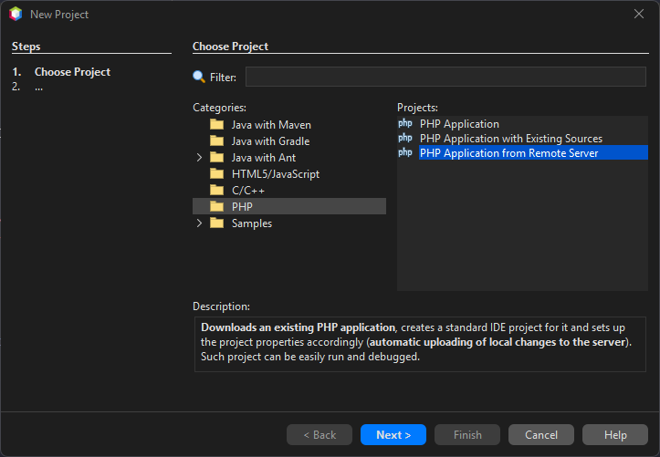
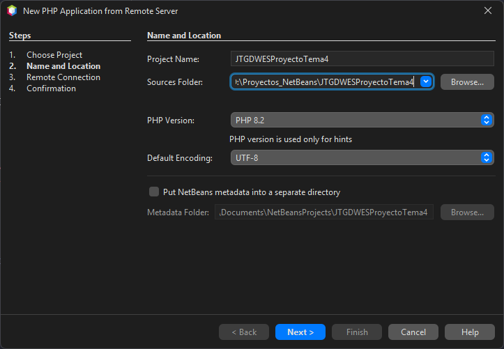
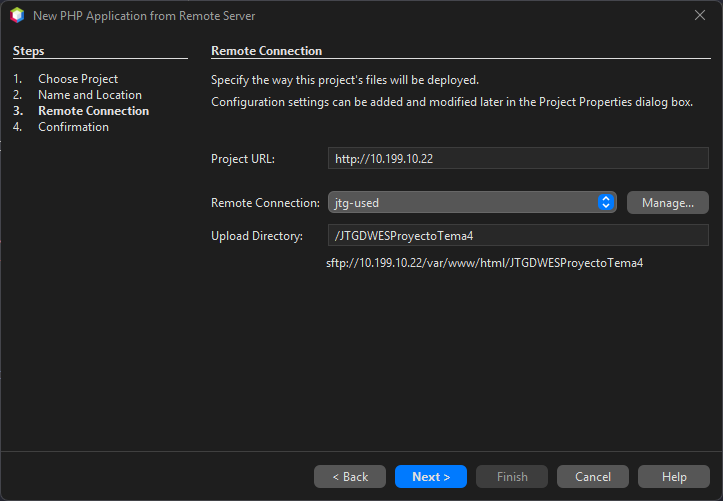
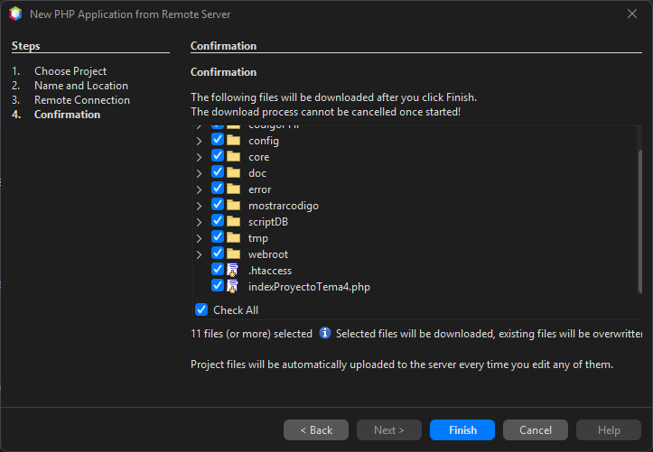
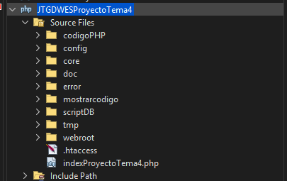
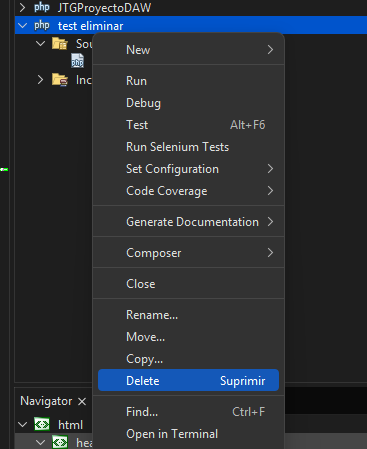
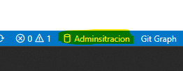

[< Volver atrás](README.md)

- [Windows 11](#windows-11)
  - [**1 Configuración inicial**](#1-configuración-inicial)
    - [Nombre y configuración de red](#nombre-y-configuración-de-red)
    - [Cuentas administradoras](#cuentas-administradoras)
  - [**2 Navegadores**](#2-navegadores)
  - [**3 MovaXterm**](#3-movaxterm)
  - [**4 NetBeans**](#4-netbeans)
    - [Creación de proyectos](#creación-de-proyectos)
    - [Eliminación de proyectos](#eliminación-de-proyectos)
    - [Información del IDE](#información-del-ide)
  - [**5 Visual Studio Code**](#5-visual-studio-code)
    - [Como crear un Workspace](#como-crear-un-workspace)
    - [Conexión SFTP con maquina de desarrollo](#conexión-sftp-con-maquina-de-desarrollo)
    - [Control de versiones](#control-de-versiones)
    - [Debug PHP (Xdebug)](#debug-php-xdebug)
    - [Conexión con la BBDD (MariaDB)](#conexión-con-la-bbdd-mariadb)
    - [Información del IDE](#información-del-ide-1)

---

> **Jesús Temprano Gallego**  
> Curso: 2025/2026  
> 2º Curso CFGS Desarrollo de Aplicaciones Web  
> Despliegue de aplicaciones web

# Windows 11
## **1 Configuración inicial**
### Nombre y configuración de red
### Cuentas administradoras
## **2 Navegadores**

## **3 MovaXterm**

Para crear una nueva sesión de usuario le damos aquí:




Se abrirá un menú para elegir el tipo de conexión.
Elegiremos SSH y pondremos la IP del servidor, marcamos la casilla y ponemos nuestro usuario.



Al darle a Ok nos pedirá la contraseña. Se la ponemos y ya estaría creada la sesión para poder administrar el servidor.


## **4 NetBeans**

### Creación de proyectos

Clicamos en el botón de crear un nuevo proyecto.



---

Seleccionamos el tipo de proyecto:



---

Seleccionamos el nombre del proyecto y en la carpeta donde se va a guardar



---

Seleccionamos la dirección de nuestro servidor y a que carpeta se subirán los archivos



---

Confirmamos el mensaje que aparece y le damos a finalizar.



---

Y ya lo tenemos




### Eliminación de proyectos

Le damos click derecho al proyecto que queramos eliminar.



Una vez le damos, nos preguntara si queremos también eliminar todos los archivos (locales). Lo seleccionamos si queremos y le damos a "Yes". Para que se elimine

### Información del IDE

> **Pagina Oficial**: https://netbeans.apache.org/ \
> **Versión**: 20 \
> **Link Descarga Versión**: https://netbeans.apache.org/front/main/download/nb20/ \
> **Módulos Instalados**: 0

## **5 Visual Studio Code**

***Primero que nada, importante instalar estas extensiones. Mas adelante explicare como usar las obligatorias:***

Extensiones **obligatorias**:
[SFTP](https://marketplace.visualstudio.com/items?itemName=Natizyskunk.sftp),
[PHP Extension Pack (Xdebug & Autocompletado avanzado)](https://marketplace.visualstudio.com/items?itemName=xdebug.php-pack),
[PHP Intelephense](https://marketplace.visualstudio.com/items?itemName=bmewburn.vscode-intelephense-client),
[SQLTools](https://marketplace.visualstudio.com/items?itemName=mtxr.sqltools),
[MySQL/MariaDB Support for SQLTools](https://marketplace.visualstudio.com/items?itemName=mtxr.sqltools-driver-mysql).

Extensiones **opcionales** pero bastante útiles:
[Live Server](https://marketplace.visualstudio.com/items?itemName=ritwickdey.LiveServer),
[VirtualBox](https://marketplace.visualstudio.com/items?itemName=acherkashin.virtualbox-extension),
[JsDoc](https://marketplace.visualstudio.com/items?itemName=lllllllqw.jsdoc),
[Prettier](https://marketplace.visualstudio.com/items?itemName=esbenp.prettier-vscode)
[HTML CSS Intellisense](https://marketplace.visualstudio.com/items?itemName=ecmel.vscode-html-css).

### Como crear un Workspace

Un workspace es una colección de una o más carpetas abiertas en una sola ventana del editor. \
Sirve para organizar proyectos y aplicar configuraciones específicas a cada uno. \
Puedes guardar estas colecciones como un archivo ``.code-workspace`` con formato **JSON** para editar y compartir fácilmente la configuración. (Muy recomendado para después)

Para crearlo, primero abrimos una ventana vacía sin ninguna carpeta abierta con ``Ctrl + Shift + N``. \
Una vez abierta, arriba del todo a la izquierda. Le damos a ***File > Add Folder to Workspace...*** \
Nos abrirá un explorador. Yo recomiendo que; en el directorio que prefieras, crees una carpeta para el workspace, y dentro se cree una carpeta para cada proyecto. Algo así:
```
D:\
└── ProyectosWebDAW -> (Carpeta Workspace)
    ├── xxxDAWProyectoDAW
    ├── xxxDWECProyectoDWEC -> (Carpeta proyecto)
    ├── xxxDWESProyectoDWES
    ├── xxxProyectoDAW
    └── ...
```
> *Si ya están los proyectos creados del NetBeans, la carpeta del workspace seria "D:\Proyectos_NetBeans" (O como se llame la carpeta).*

Una vez creadas las carpetas. Seleccionamos las carpetas **DENTRO** de ***ProyectosWebDAW***, no la carpeta ***ProyectosWebDAW*** en si. (Se pueden seleccionar todas a la vez)

Una vez hecho. En el explorador del editor aparecerán los diferentes proyectos. 

> **IMPORTANTE**: Ir al ***File > Save Workspace As...*** y guardarlo *(Preferiblemente en la carpeta del workspace)*. Es necesario para algunas configuraciones mas tarde.

### Conexión SFTP con maquina de desarrollo

En cada proyecto creamos una carpeta llamada ``.vscode/`` y que dentro tenga el archivo ``sftp.json``. (O se hace una vez y copiamos y pegamos la carpeta mas rápido).

El archivo tiene que tener este formato (modificar ``name``, ``host`` y ``remotePath``, y borrar los comentarios para que funcione):
```json
{
  "name": "NombreConexion",
  "context": ".", # Carpeta donde se suben/descargan los archivos en local ('.' = carpeta proyecto)
  "host": "10.199.10.22",
  "username": "operadorweb",
  "password": "paso", # Si no se pone te pregunta cada vez que cierres y abres el editor
  "remotePath": "/var/www/html/PROYECTO", # Carpeta donde se suben/descargan los archivos en el servidor
  "uploadOnSave": true, # Sube archivos automaticamente al modificar
  "ignore": [
      ".git",
      ".DS_Store"
  ],
  "remoteExplorer": {
    "filesExclude": [
      ".git",
      ".DS_Store",
      ".cache",
      ".local",
      ".cache",
      ".bash_history",
      ".bashrc"
    ]
  }
}
```

Para subir/descargar archivos manualmente, podemos seleccionar el archivo en cuestión, la carpeta o el proyecto entero y darle a:
- ``Sync Local -> Remote``: Para pasar lo del local a remoto.
- ``Sync Remote -> Local``: Para pasar lo del remoto a local.
- ``Sync Both Directions``: Para pasar hacer ambos a la vez.

*(Para pasar imágenes o documentos externos se le tiene que dar manualmente siempre)*

### Control de versiones

Para abrir el panel para el control de versiones, en la barra lateral buscamos un icono con un círculo dividido con ramas; o hacemos ``Ctrl + Shift + G``.

Desde hay podemos controlar todos los git de cada proyecto (Hacer commits, cambiar ramas, crear y añadir tags, gestionar stashes, ...).

Para una explicación mas detallada sobre como gestionar un repositorio git por VSCode lo explico [aquí](Git.md#gestión-de-un-repositorio-vscode).

Estaría bien incluir esto en los ``.gitignore`` del proyecto:
```
.bash_history
.bashrc
.wget-hsts
.cache/
.dotnet/
.local/
.ssh/
.vscode-server/
.vscode/

*.code-workspace
nbproject/
```

### Debug PHP (Xdebug)

Para debuggear PHP con Xdebug, primero, ir a la configuración y buscar "**php.debug.idekey**" y ponerle el valor "**netbeans-xdebug**".

Y después en el archivo ``.code-workspace`` al nivel de **"folders"** poner este launch *(cambiando la ruta remota y nombre del directorio local por la que corresponda)*:
```json
{
  "folders": [
    ...
  ],
  "launch": {
        "version": "0.2.0",
        "configurations": [
            {
                "name": "Listen for Xdebug",
                "type": "php",
                "request": "launch",
                "port": 9003,
                "stopOnEntry": false,
                "pathMappings": {
                    "/var/www/html": "${workspaceFolder:xxxProyectoDAW}",
                    "/var/www/html/xxxDAWProyectoDAW":    "${workspaceFolder:xxxDAWProyectoDAW}",
                    "/var/www/html/xxxDWECProyectoDWEC":  "${workspaceFolder:xxxDWECProyectoDWEC}",
                    "/var/www/html/xxxDWESProyectoDWES":  "${workspaceFolder:xxxDWESProyectoDWES}",
                    "/var/www/html/xxxDWESProyectoTema3": "${workspaceFolder:xxxDWESProyectoTema3}",
                    "/var/www/html/xxxDWESProyectoTema4": "${workspaceFolder:xxxDWESProyectoTema4}",
                    "/var/www/html/xxxCIBProyectoCiberseguridad": "${workspaceFolder:xxxCIBProyectoCiberseguridad}"
                },
                "xdebugSettings": {
                    "max_data": 2048,
                }
            }
        ]
    },
}
```

Una vez hecho esto, vamos al apartado de debug de vscode buscando el icono con el triangulo de play con un insecto al lado; o presionando ``Ctrl + Shift + D``. \
Si le damos al Run **Listen for Xdebug** 

### Conexión con la BBDD (MariaDB)

Buscamos en la barra lateral el icono de un cilindro.

Una vez en el, en el apartado ***CONNECTIONS*** le damos a ***Add New Connection***, se nos abrirá un apartado para elegir la DB que queramos usar. Seleccionaremos **MariaDB**.

Se abrirá aun formulario par completar la configuración de la conexión. Lo rellenamos con los datos necesarios. (Para el usuario administrador de la base de datos, en el `Database` ponemos **mysql** para que tenga acceso a todas las BBDD)

Para ejecutar consultas, primero verificamos cual es la conexión activa con la que haremos la consulta hacemos clic aquí y seleccionamos la que queramos si tenemos múltiples: \


Una vez hecho esto, abrimos un archivo SQL hacemos click en la consulta que queramos ejecutar (se marca en azul) o seleccionamos varias con el ratón, y le damos ***dos veces*** `Ctrl + E` para ejecutarla/s. \
*(Para ejecutar todo el archivo, se haría `Ctrl + A` para seleccionar todo el archivo y **dos veces** `Ctrl + E`)*


### Información del IDE

> **Pagina Oficial**: https://code.visualstudio.com/ \
> **Versión**: Ultima versión (Actualizada automáticamente) \
> **Link Descarga**: https://code.visualstudio.com/Download \
> **Extensiones Instaladas**: Las de arriba

