# CFGS Desarrollo de Aplicaciones Web


- [CFGS Desarrollo de Aplicaciones Web](#cfgs-desarrollo-de-aplicaciones-web)
  - [1. Entorno de Desarrollo](#1-entorno-de-desarrollo)
    - [1.1 Ubuntu Server 24.04.3 LTS](#11-ubuntu-server-24043-lts)
      - [1.1.1 **Configuración inicial**](#111-configuración-inicial)
        - [Nombre y configuración de red](#nombre-y-configuración-de-red)
        - [**Actualizar el sistema**](#actualizar-el-sistema)
        - [**Configuración fecha y hora**](#configuración-fecha-y-hora)
        - [**Cuentas administradoras**](#cuentas-administradoras)
        - [**Cortafuegos (UFW)**](#cortafuegos-ufw)
          - [Instalacion](#instalacion)
          - [Configuracion](#configuracion)
          - [Monitorizacion](#monitorizacion)
          - [Mantenimiento](#mantenimiento)
        - [**SSH**](#ssh)
          - [Instalacion](#instalacion-1)
          - [Configuracion](#configuracion-1)
          - [Monitorizacion](#monitorizacion-1)
          - [Mantenimiento](#mantenimiento-1)
        - [**Antivirus**](#antivirus)
          - [Instalacion](#instalacion-2)
          - [Configuracion](#configuracion-2)
          - [Monitorizacion](#monitorizacion-2)
          - [Mantenimiento](#mantenimiento-2)
      - [1.1.2 Servidor web (Apache)](#112-servidor-web-apache)
        - [Instalación](#instalación)
        - [Configuracion](#configuracion-3)
        - [Monitorizacion](#monitorizacion-3)
        - [Mantenimiento](#mantenimiento-3)
        - [Virtual Hosts](#virtual-hosts)
        - [Permisos y usuarios](#permisos-y-usuarios)
        - [HTTPS](#https)
      - [1.1.3 PHP-FPM](#113-php-fpm)
        - [Instalacion](#instalacion-3)
        - [Configuracion](#configuracion-4)
        - [Monitorizacion](#monitorizacion-4)
        - [Mantenimiento](#mantenimiento-4)
      - [1.1.4 MariaDB](#114-mariadb)
        - [Instalacion](#instalacion-4)
        - [Configuracion](#configuracion-5)
        - [Monitorizacion](#monitorizacion-5)
        - [Mantenimiento](#mantenimiento-5)
      - [1.1.5 XDebug](#115-xdebug)
        - [Instalacion](#instalacion-5)
        - [Configuracion](#configuracion-6)
        - [Monitorizacion](#monitorizacion-6)
        - [Mantenimiento](#mantenimiento-6)
      - [1.1.6 DNS](#116-dns)
      - [1.1.7 SFTP](#117-sftp)
      - [1.1.8 Apache Tomcat](#118-apache-tomcat)
      - [1.1.9 LDAP](#119-ldap)
    - [1.2 Windows 11](#12-windows-11)
      - [1.2.1 **Configuración inicial**](#121-configuración-inicial)
        - [**Nombre y configuración de red**](#nombre-y-configuración-de-red-1)
        - [**Cuentas administradoras**](#cuentas-administradoras-1)
      - [1.2.2 **Navegadores**](#122-navegadores)
      - [1.2.3 **MovaXterm**](#123-movaxterm)
      - [1.2.4 **Netbeans**](#124-netbeans)
        - [Creacion de proyectos](#creacion-de-proyectos)
        - [Eliminacion de proyectos](#eliminacion-de-proyectos)
        - [Informacion del IDE](#informacion-del-ide)
      - [1.2.5 **Visual Studio Code**](#125-visual-studio-code)
        - [Como crear un Workspace](#como-crear-un-workspace)
        - [Conexion SFTP con maquina de desarrollo](#conexion-sftp-con-maquina-de-desarrollo)
        - [Control de versiones](#control-de-versiones)
        - [Debug PHP (Xdebug)](#debug-php-xdebug)
        - [Informacion del IDE](#informacion-del-ide-1)
  - [2. GitHub](#2-github)
  - [3.Entorno de Explotación](#3entorno-de-explotación)

|  DAW/DWES Tema2 |
| :-----------:|
||
| INSTALACIÓN, CONFIGURACIÓN Y DOCUMENTACIÓN DE ENTORNO DE DESARROLLO Y DEL ENTORNO DE EXPLOTACIÓN |

## 1. Entorno de Desarrollo

### 1.1 Ubuntu Server 24.04.3 LTS

Este documento es una guía detallada del proceso de instalación y configuración de un servidor de aplicaciones en Ubuntu Server utilizando Apache, con soporte PHP y MySQL

#### 1.1.1 **Configuración inicial**

##### Nombre y configuración de red

> **Nombre de la máquina**: daw-used\
> **Memoria RAM**: 2G\
> **Particiones**: 150G(/) y resto (/var)\
> **Configuración de red interface**: enp0s3 \
> **Dirección IP** :10.199.10.22/22\
> **GW**: 10.199.8.1/22\
> **DNS**: 10.151.123.21 y 10.151.126.21

Para comprobar esto usamos:
```bash
hostname    # Para ver el nombre de la maquina
ip a        # Para ver la IP y interface
ip r        # Par ver la IP, interface y gateway
resolvectl  # Para ver el DNS
df -h       # Para ver las particiones
fdisk -l    # # Para ver las particiones (fromato mas limpio)
cat /etc/os-release # Ver la verison del SO
```

---

Cambiamos el nombre de la maquina con:
```bash
sudo hostnamectl set-hostname <nombre>
sudo nano /etc/hosts
```

---

Editamos el fichero de configuración del interface de red  **``/etc/netplan``**, con estos datos:


```yaml
# This is the network config written by 'subiquity'network:
network:
  version: 2
  ethernets:
    enp0s3:
      addresses:
        - 10.199.10.22/22
      nameservers:
        addresses:
          - 10.151.123.21
          - 10.151.126.21
        search: [jesus.local]
      routes:
        - to: default
          via: 10.199.8.1
```

##### **Actualizar el sistema**

```bash
sudo apt update && sudo apt upgrade -y
```

##### **Configuración fecha y hora**

```bash
# Comprobamos la fecha con:
date
```
En caso de que este mal hacemos esto: [Establecer fecha, hora y zona horaria](https://somebooks.es/establecer-la-fecha-hora-y-zona-horaria-en-la-terminal-de-ubuntu-20-04-lts/ "Cambiar fecha y hora")

```bash
# Ponemos la zona horaria correcta para cambiar la hora
sudo timedatectl set-timezone Europe/Madrid

# Comprobamos que la fecha y/o hora han cambiado con:
date
```

##### **Cuentas administradoras**

> - [X] root(inicio)
> - [X] miadmin/paso
> - [X] miadmin2/paso

La cuenta ``root`` viene por defecto. Las otras dos las creamos con el comando:
```bash
sudo adduser <nombre_usuario>
# Te pedira contraseña, y el resto de cosas serán opcionales (teléfono, correo, etc)

# Para hacerlo administrador usamos:
sudo usermod -aG sudo,adm,cdrom,dip,plugdev,lxd <nombre_usuario>
```

o con:
```bash
sudo useradd -m -d </ruta/del/home> -s </bin/bash> -G <grupo/s> <usuario>
sudo passwd <usuario> # Para poner la contraseña
sudo chown -R <usuario>:<grupo> </ruta/del/home> # Para cambiar el dueño de la carpeta home
```

##### **Cortafuegos (UFW)**

###### Instalacion
```bash
sudo apt update
sudo apt install ufw     # Instalamos UFW si no está instalado
```
###### Configuracion
```bash
sudo ufw enable          # Activamos el cortafuegos
sudo ufw allow 22        # Abrimos el puerto 22 (SSH)
```

Para eliminar reglas específicas (por ejemplo IPv6 o cualquier otra):
```bash
sudo ufw status numbered  # Mostramos reglas con número
sudo ufw delete 2         # Eliminamos la regla con el número correspondiente
```
###### Monitorizacion
```bash
sudo ufw status verbose    # Mostramos el estado detallado del cortafuegos y las reglas activas
```
###### Mantenimiento
```bash
sudo ufw disable           # Desactivamos el cortafuegos temporalmente
sudo ufw reset             # Reseteamos todas las reglas a la configuración inicial
```

##### **SSH**

###### Instalacion
```bash
sudo apt update
sudo apt install openssh-server   # Instalamos el servidor SSH
```
###### Configuracion
```bash
sudo nano /etc/ssh/sshd_config   # Archivo de configuración SSH
sudo systemctl restart ssh       # Reiniciamos el servicio para aplicar cambios si hacemos
```
###### Monitorizacion
```bash
sudo systemctl status ssh        # Comprobamos el estado del servicio
```
###### Mantenimiento
```bash
sudo systemctl enable ssh         # Habilitamos que SSH se inicie al arrancar
sudo systemctl disable ssh        # Deshabilitamos el inicio automático si se necesita
sudo systemctl restart ssh        # Reiniciamos el servicio si hay problemas
```


##### **Antivirus**

###### Instalacion
Instalaremos el Antivirus `ClamAV`:
```bash
sudo apt update && sudo apt install -y clamav
```

###### Configuracion
Si no quieres cambiar nada, puedes verificar la configuración.
```bash
cat /etc/clamav/clamd.conf      # Mostramos la configuración del demonio
cat /etc/clamav/freshclam.conf  # Mostramos la configuración de actualizaciones
```

Si quieres actualizar la base de datos de los virus:
```bash
sudo systemctl stop clamav-freshclam   # Detenemos el servicio de actualizaciones
sudo freshclam                         # Actualizamos la base de datos de virus
sudo systemctl start clamav-freshclam  # Volvemos a iniciar el servicio
```
###### Monitorizacion
```bash
sudo systemctl status clamav-daemon    # Comprobamos el estado del servicio ClamAV
sudo systemctl status clamav-freshclam # Comprobamos el estado del servicio de actualizaciones
```
###### Mantenimiento
```bash
sudo systemctl enable clamav-daemon     # Habilitamos el demonio al inicio del sistema
sudo systemctl disable clamav-daemon    # Deshabilitamos el inicio automático si se necesita
sudo systemctl restart clamav-daemon    # Reiniciamos el servicio si hay problemas
```

#### 1.1.2 Servidor web (Apache)

Servidor web de código abierto que gestiona y entrega páginas a los usuarios. \
Permite configurar sitios, manejar peticiones HTTP/HTTPS y servir contenido dinámico y estático. \
Es compatible con módulos y lenguajes como PHP, ofreciendo gran flexibilidad y personalización.

##### Instalación
```bash
sudo apt update
sudo apt install apache2 -y   # Instalamos Apache
```
##### Configuracion
```bash
cat /etc/apache2/apache2.conf   # Mostramos la configuración principal
cat /etc/apache2/sites-available/000-default.conf  # Configuración del sitio por defecto
```
Cambiamos el `None` por `All`, para poder modificar los archivos **``.htaccess``**
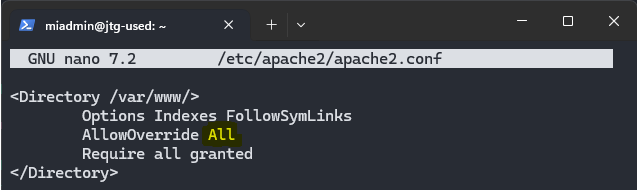

Para aplicar los cambios despues de editar usamos:
```bash
sudo apache2ctl configtest      # Comprobamos que no de errores = "Syntax OK"
sudo systemctl restart apache2  # Reiniciamos el servicio para aplicar cambios
```
Abrimos el puerto 80:
```bash
sudo ufw allow 80         # Abrimos el puerto 80 (HTTP)
sudo ufw status numbered  # Mostramos reglas con número
sudo ufw delete 3         # Eliminamos la regla IPv6
```
##### Monitorizacion
```bash
sudo systemctl status apache2   # Comprobamos si Apache está activo
sudo ufw status | grep "80"     # Verificamos que el puerto 80 está escuchando
```
##### Mantenimiento
```bash
sudo systemctl start apache2     # Iniciamos el servicio si está detenido
sudo systemctl stop apache2      # Detenemos el servicio
sudo systemctl restart apache2   # Reiniciamos el servicio
sudo systemctl enable apache2    # Habilitamos el inicio automático al arrancar
sudo systemctl disable apache2   # Deshabilitamos el inicio automático si se necesita

```

---

<!-- documentar "/etc/apache2/" y subcarpetas -->
Los archivos de configuracion de Apache se encuentran en **``/etc/apache2/``**:
  - **``apache2.conf``**: es el archivo de configuracion inicial. Es el primer fichero que se ejecuta cuando arrancamos el servidor.
  - **``ports.conf``**: donde se definen los puertos en los que Apache escuchará las conexiones
  - **``mods-available/``**: Contiene todos los módulos de Apache que están instalados en el sistema.
  - **``mods-enabled/``**: Contiene enlaces simbólicos a los módulos de mods-available/ que están activos, es decir, cargados y funcionando en el servidor.
  - **``conf-available/``**: Almacena archivos de configuración global mediante enlaces simbólicos influyendo en la configuración general del servidor.
  - **``conf-enabled/``**: Contiene enlaces simbólicos a los archivos de conf-available/ que están activos, aplicando su configuración al servidor.
  - **``sites-available/``**: Guarda archivos de configuración de sitios virtuales mediante enlaces simbólicos, permitiendo configurar diferentes sitios alojados en el mismo servidor
  - **``sites-enabled/``**: Contiene enlaces simbólicos a los archivos de sites-available/ que están activos, habilitando los sitios virtuales correspondientes.

---

Para comprobar que los cambios en la documentacion funcionnan correctamente usamos:
```bash
sudo apache2ctl configtest
```


##### Virtual Hosts
##### Permisos y usuarios

> - [X] operadorweb/paso
> - [X] operadorweb2/paso
> - [X] operadorweb3/paso

Creamos un usuario llamado `operadorweb` que tenga el grupo `www-data`.

```bash
# Creamos el usuario
sudo useradd -m -d /var/www/html/ -s /bin/bash -g www-data operadorweb

# Le ponemos contraseña
sudo passwd operadorweb


# Cambiamos el propietario de su carpeta home con:
sudo chown -R operadorweb:www-data /var/www/html/

# Y los permisos con:
sudo chmod -R 775 /var/www/html
```

Y habilitamos el puerto 80 en el UFW si no esta ya.

##### HTTPS

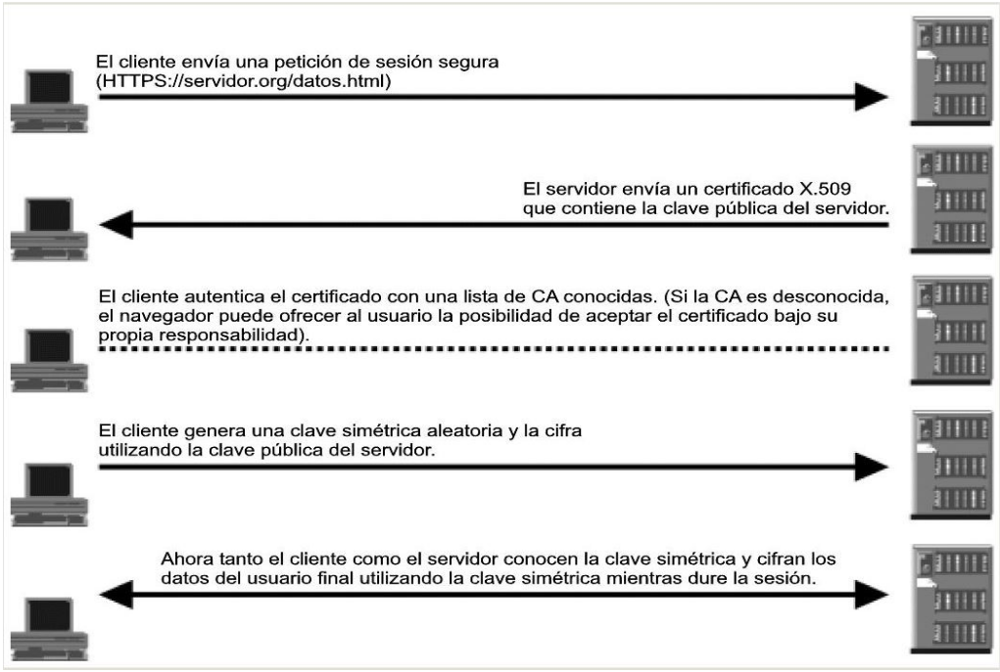


Generamos un certificado autofirmado y su clave privada (válido 1 año), y rellenamos la info que nos pide.
```bash
sudo openssl req -x509 -nodes -days 365 -newkey rsa:2048 -keyout /etc/ssl/private/jtg-used.key -out /etc/ssl/certs/jtg-used.crt
```

Comprobamos que se han creado correctamente los certificados:
```bash
sudo ls -la /etc/ssl/certs/   | grep jtg-used
sudo ls -la /etc/ssl/private/ | grep jtg-used
```

Habilitamnos el modulo ssh, y configuramos un sitio para que lo use.
```bash
sudo a2enmod ssl
sudo systemctl restart apache2
cd /etc/apache2/sites-available/
sudo cp default-ssl.conf jtg-used.conf
sudo nano jtg-used.conf
```
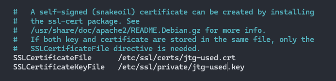

Habilitamos el sitio y reiniciamos apache para aplicar cambios.
```bash
sudo a2ensite jtg-used.conf
sudo systemctl reload apache2
```

Para terminar, abrimos el puerto 443 para permitir HTTPS.
```bash
sudo ufw allow 443
```

#### 1.1.3 PHP-FPM

Gestor de procesos para ejecutar PHP de forma eficiente. \
Permite procesar múltiples peticiones simultáneamente, mejorando el rendimiento de servidores web. \
Se integra con servidores como Nginx o Apache para servir páginas PHP de manera rápida y estable.

##### Instalacion

```bash
# --- Actualizar paquetes y preparar el sistema ---
# Se asegura que todos los paquetes estén actualizados y se instalan
# herramientas necesarias para añadir repositorios externos.
sudo apt update
sudo apt install software-properties-common -y

# --- Añadir repositorio de PHP actualizado ---
# Se añade el PPA de Ondřej Surý para poder instalar versiones recientes
# de PHP y se verifica que el repositorio se haya añadido correctamente.
sudo add-apt-repository ppa:ondrej/php -y
ls /etc/apt/sources.list.d/ | grep ondrej
sudo apt update

# --- Instalar PHP 8.3 y PHP-FPM ---
# Se instala PHP 8.3 junto con FPM, que permite que Apache gestione PHP
# de forma más eficiente y segura que el módulo tradicional.
sudo apt install libapache2-mod-php8.3 php8.3-fpm -y

# --- Configurar Apache para usar PHP-FPM ---
# Se habilita el proxy para PHP-FPM, se desactiva mpm_prefork y el módulo
# PHP tradicional y se activa mpm_event, optimizando Apache para trabajar
# con PHP-FPM.
sudo a2enmod proxy_fcgi
sudo a2dismod mpm_prefork
sudo a2dismod php8.3
sudo a2dismod mpm_prefork
sudo a2enmod mpm_event proxy_fcgi
sudo a2enconf php8.3-fpm

# --- Reiniciar y recargar Apache ---
# Se aplican todos los cambios de configuración reiniciando Apache y
# recargando servicios.
sudo systemctl restart apache2
sudo systemctl reload apache2
```

##### Configuracion

El archivo principal de configuración de PHP-FPM se encuentra en ``/etc/php/8.3/fpm/php.ini``.

Hacemos una copia de seguridad de `php.ini` y despues lo editamos cambiando estos valores:

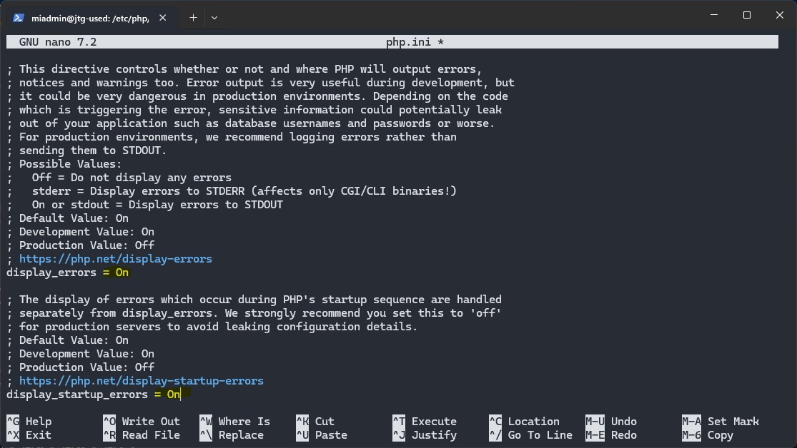
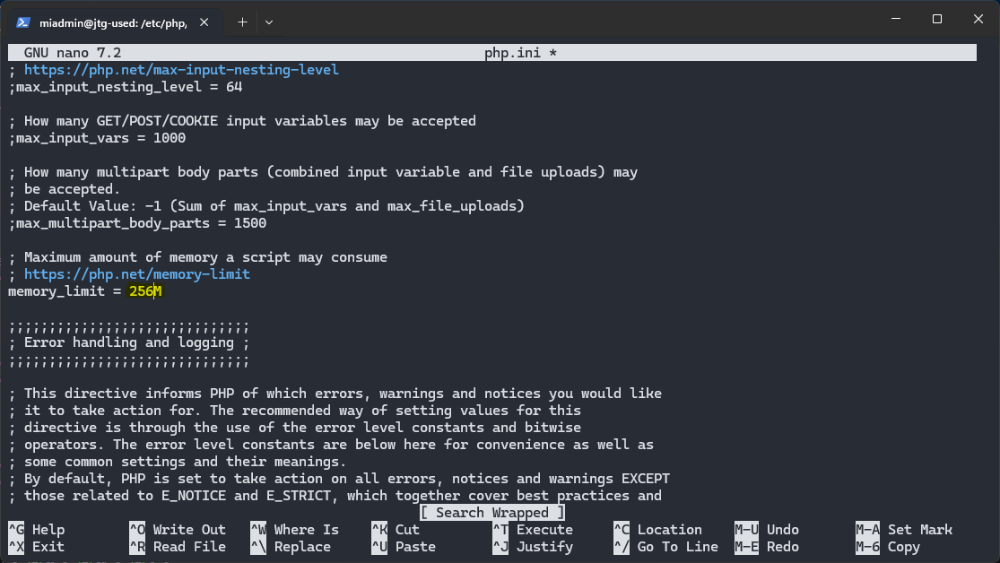

Y reiniciamos el servicio para aplicar los cambios a la configuracion con:
```bash
sudo systemctl restart php8.3-fpm
```

##### Monitorizacion

```bash
sudo systemctl status php8.3-fpm   # Verifica el estado de PHP-FPM
php -v    # Comprobamos la versión de PHP
php -m    # Lista los módulos activos
```

##### Mantenimiento

```bash
sudo systemctl start php8.3-fpm      # Inicia el servicio
sudo systemctl stop php8.3-fpm       # Detiene el servicio
sudo systemctl restart php8.3-fpm    # Reinicia el servicio
sudo systemctl enable php8.3-fpm     # Habilita inicio automático al arrancar
sudo systemctl disable php8.3-fpm    # Deshabilita inicio automático
```

#### 1.1.4 MariaDB

Sistema de gestión de bases de datos relacional y de código abierto, compatible con MySQL. \
Permite almacenar, consultar y gestionar datos de forma segura y eficiente. \
Se puede acceder desde aplicaciones y IDEs mediante conexión local o remota usando el puerto **3306**.

##### Instalacion
Instalamos con:
```bash
sudo apt update
sudo apt install mariadb-server -y  # Instalamos el servidor MariaDB
```

##### Configuracion
El archivo principal de configuración se encuentra en:
```
/etc/mysql/mariadb.conf.d/50-server.cnf
```

Editamos la línea del ``bind-address`` para permitir conexiones desde cualquier IP (por defecto solo permite localhost), cambiandolo de ``127.0.0.1`` por ``0.0.0.0`` para permitir todas las conexiones externas.

Guardamos los cambios y entramos en MariaDB para crear un nuevo usuario administrador con ``sudo mariadb`` \
Y creamos el usuario con:
```sql
GRANT ALL ON *.* TO 'adminsql'@'%' IDENTIFIED BY 'password' WITH GRANT OPTION;
```

Ejecutamos el asistente de seguridad:
```bash
sudo mysql_secure_installation   # Configuramos contraseña root y opciones de seguridad
```

* En el primer paso preguntará por la contraseña de `root` para MariaDB, pulsa la tecla `Enter` ya que no hay contraseña definida.
* La siguiente, preguntará si quieres asignar una contraseña para el usuario “root”. Es recomendable usar una contraseña.
* En el tercer paso preguntará si quieres eliminar `usuario anónimo`, aquí indica que `Sí` quieres borrar los datos.
* Después preguntará si quieres desactivar el acceso remoto del usuario “root”, aquí indica que `Sí` quieres desactivar acceso remoto para usuario por seguridad.
* De nuevo preguntará si quieres eliminar la base de datos `test`, aquí indica de nuevo que Sí quieres borrar las base de datos de prueba.
* Por último, preguntará si quieres recargar privilegios, aquí indica que `Sí`.

Reiniciamos el servicio para aplicar los cambios:
```bash
sudo systemctl restart mariadb
```

##### Monitorizacion

Verificamos la IP y el puerto que está utilizando MariaDB:
```bash
sudo ss -punta | grep mariadb   # Muestra conexiones activas y puertos usados por MariaDB
```

Comprobamos el estado del servicio:
```bash
sudo systemctl status mariadb
```

##### Mantenimiento
```bash
sudo systemctl start mariadb      # Inicia el servicio
sudo systemctl stop mariadb       # Detiene el servicio
sudo systemctl restart mariadb    # Reinicia el servicio
sudo systemctl enable mariadb     # Habilita el inicio automático
sudo systemctl disable mariadb    # Deshabilita el inicio automático
```

Comprobamos si PHP detecta los módulos de MySQL/MariaDB:
```bash
sudo php -m | grep mysql
```

#### 1.1.5 XDebug

Es un módulo de PHP que permite depurar y analizar el código de forma más sencilla. \
Permite inspeccionar variables, pausar la ejecución y seguir el flujo del programa paso a paso. \
Se integra con IDEs mediante el puerto **9003** para depuración remota.

##### Instalacion

```bash
sudo apt update
sudo apt install php8.3-xdebug -y   # Instalamos XDebug para PHP 8.3
```

Verificamos que XDebug está activo:
```bash
sudo php -v | grep Xdebug   # Con la X mayuscula; sino no aparece
```

##### Configuracion

El archivo principal de configuración se encuentra en:
```bash
/etc/php/8.3/fpm/conf.d/20-xdebug.ini:
```

Y tiene que tener esto:
```bash
zend_extension=xdebug.so
xdebug.mode=develop,debug
xdebug.start_with_request=yes
xdebug.client_port=9003
xdebug.log=/tmp/xdebug.log
xdebug.log_level=7
xdebug.idekey="netbeans-xdebug"
xdebug.discover_client_host=1
```

Reiniciamos PHP-FPM para aplicar los cambios:
```bash
sudo systemctl restart php8.3-fpm
```

##### Monitorizacion

Verificamos que XDebug está cargado:
```bash
php -m | grep xdebug
```

Podemos revisar el log para errores o avisos:
```bash
cat /tmp/xdebug.log
```

##### Mantenimiento

```bash
sudo systemctl start php8.3-fpm      # Inicia el servicio PHP-FPM
sudo systemctl stop php8.3-fpm       # Detiene el servicio
sudo systemctl restart php8.3-fpm    # Reinicia el servicio
sudo systemctl enable php8.3-fpm     # Habilita inicio automático
sudo systemctl disable php8.3-fpm    # Deshabilita inicio automático
```

#### 1.1.6 DNS
#### 1.1.7 SFTP
#### 1.1.8 Apache Tomcat
#### 1.1.9 LDAP

### 1.2 Windows 11
#### 1.2.1 **Configuración inicial**
##### **Nombre y configuración de red**
##### **Cuentas administradoras**
#### 1.2.2 **Navegadores**

#### 1.2.3 **MovaXterm**

Para crear una nueva sesion de usuario le damos aqui:

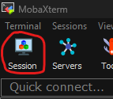


Se abrira un menu para elegir el tipo de conexion.
Elegiremos SSH y pondremos la IP del servidor, marcamos la casilla y ponemos nuestro uruario.

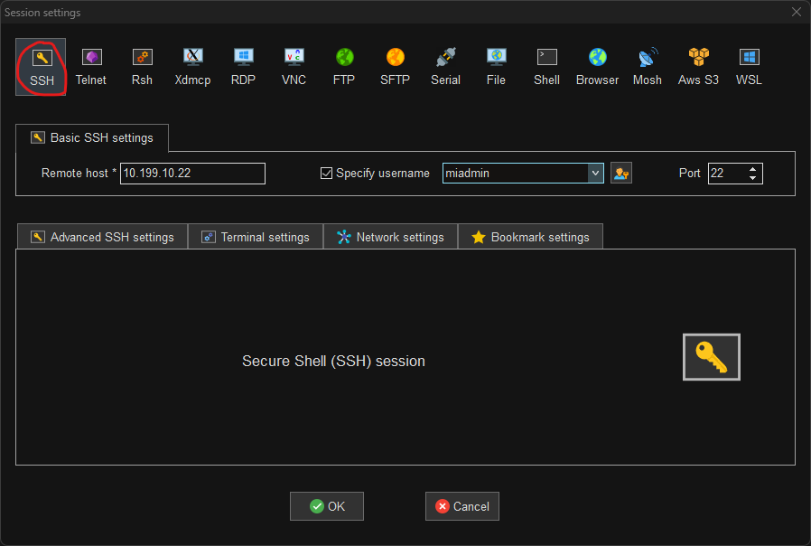

Al darle a Ok nos pedira la contraseña. Se la ponemos y ya estaria creada la sesion para poder administrar el servidor.


#### 1.2.4 **Netbeans**

##### Creacion de proyectos

Clicamos en el boton de crear un nuevo proyecto.

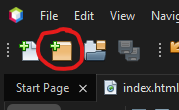

---

Seleccionamos el tipo de proywcto:

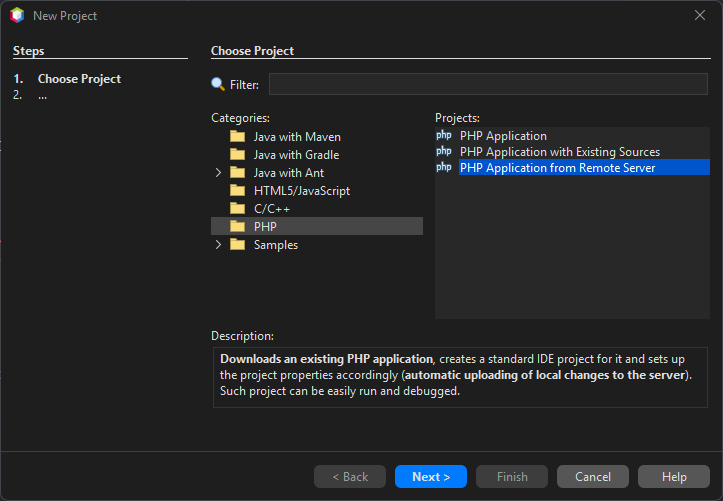

---

Seleccionamos el nombre del proyecto y en la carpeta donde se va a guardar

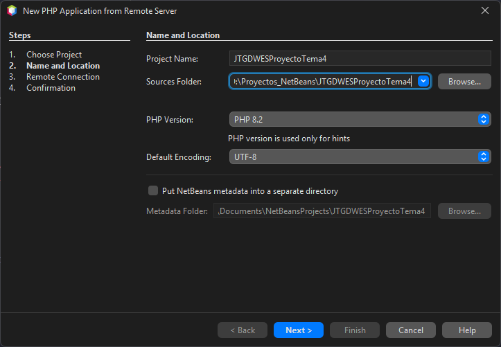

---

Seleccionamos la direccion de nuestro servidor y a que carpeta se subiran los archivos

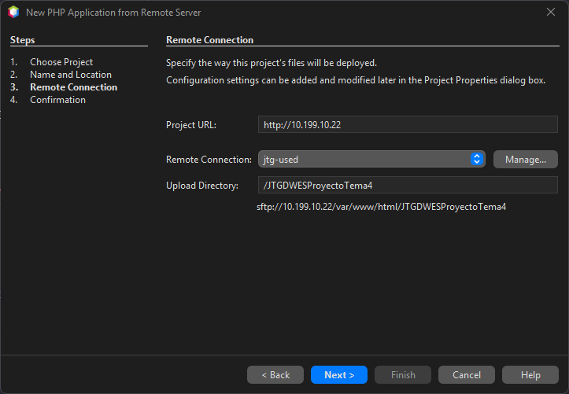

---

Confirmamos el mensaje que aparece y le damos a finalizar.

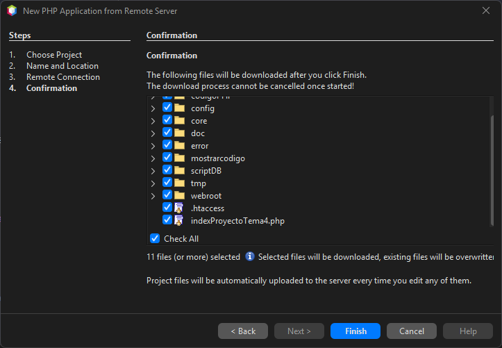

---

Y ya lo tenemos

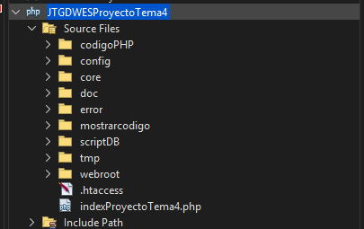


##### Eliminacion de proyectos

Le damos click derecho al proyecto que queramos eliminar.

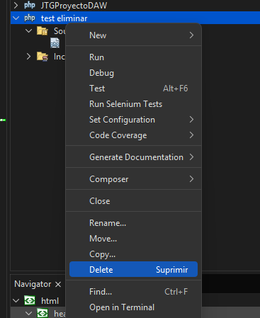

Una vez le damos, nos preguntara si queremos tambien eliminar todos los archivos (locales). Lo seleccionamos si queremos y le damos a "Yes". Para que se elimine

##### Informacion del IDE

> **Pagina Oficial**: https://netbeans.apache.org/ \
> **Version**: 20 \
> **Link Descarga Version**: https://netbeans.apache.org/front/main/download/nb20/ \
> **Modulos Instalados**: 0

#### 1.2.5 **Visual Studio Code**

***Primero que nada, importante instalar estas extensiones. Mas adelante explicare como usar las obligatorias:***

Extensiones **obligatorias**:
[SFTP](https://marketplace.visualstudio.com/items?itemName=Natizyskunk.sftp),
[PHP Extension Pack (Xdebug & Autocompletado avanzado)](https://marketplace.visualstudio.com/items?itemName=xdebug.php-pack),
[PHP Intelephense](https://marketplace.visualstudio.com/items?itemName=bmewburn.vscode-intelephense-client),
[SQLTools](https://marketplace.visualstudio.com/items?itemName=mtxr.sqltools),
[MySQL/MariaDB Support for SQLTools](https://marketplace.visualstudio.com/items?itemName=mtxr.sqltools-driver-mysql).

Extensiones **opcionales** pero bastante utiles:
[Live Server](https://marketplace.visualstudio.com/items?itemName=ritwickdey.LiveServer),
[VirtualBox](https://marketplace.visualstudio.com/items?itemName=acherkashin.virtualbox-extension),
[JsDoc](https://marketplace.visualstudio.com/items?itemName=lllllllqw.jsdoc),
[Prettier](https://marketplace.visualstudio.com/items?itemName=esbenp.prettier-vscode)
[HTML CSS Intellisense](https://marketplace.visualstudio.com/items?itemName=ecmel.vscode-html-css).

##### Como crear un Workspace

Un workspace es una colección de una o más carpetas abiertas en una sola ventana del editor. \
Sirve para organizar proyectos y aplicar configuraciones específicas a cada uno. \
Puedes guardar estas colecciones como un archivo ``.code-workspace`` con formato **JSON** para editar y compartir fácilmente la configuracion. (Muy recomendado para despues)

Para crearlo, primero abrimos una ventana vacia sin ninguna carpeta abierta con ``Ctrl + Shift + N``. \
Una vez abierta, arriba del todo a la izquierda. Le damos a ***File > Add Folder to Workspace...*** \
Nos abrira un explorador. Yo recomiendo que; en el directorio que prefieras, crees una carpeta para el workspace, y dentro se cree una carpeta para cada proyecto. Algo asi:
```
D:\
└── ProyectosWebDAW -> (Carpeta Workspace)
    ├── xxxDAWProyectoDAW
    ├── xxxDWECProyectoDWEC -> (Carpeta proyecto)
    ├── xxxDWESProyectoDWES
    ├── xxxProyectoDAW
    └── ...
```
> *Si ya estan los proyectos creados del netbeans, la carpeta del workspace seria "D:\Proyectos_NetBeans" (O como se llame la carpeta).*

Una vez creadas las carpetas. Seleccionamos las carpetas **DENTRO** de ***ProyectosWebDAW***, no la carpeta ***ProyectosWebDAW*** en si. (Se pueden seleccionar todas a la vez)

Una vez hecho. En el explorador del editor apareceran los diferentes proyectos. 

> **IMPORTANTE**: Ir al ***File > Save Workspace As...*** y guardarlo *(Preferiblemente en la carpeta del workspace)*. Es necesario para algunas configuraciones mas tarde.

##### Conexion SFTP con maquina de desarrollo

En cada proyecto creamos una carpeta llamada ``.vscode/`` y que dentro tenga el archivo ``sftp.json``. (O se hace una vez y copiamos y pegamos la carpeta mas rapido).

El archivo tiene que tener este formato (modificar ``name``, ``host`` y ``remotePath``, y borrar los comentarios para que funcione):
```json
{
  "name": "NombreConexion",
  "context": ".", # Carpeta donde se suben/descargan los archivos en local ('.' = carpeta proyecto)
  "host": "10.199.10.22",
  "username": "operadorweb",
  "password": "paso", # Si no se pone te pregunta cada vez que cierres y abres el editor
  "remotePath": "/var/www/html/PROYECTO", # Carpeta donde se suben/descargan los archivos en el servidor
  "uploadOnSave": true, # Sube archivos automaticamente al modificar
  "ignore": [
      ".git",
      ".DS_Store"
  ],
  "remoteExplorer": {
    "filesExclude": [
      ".git",
      ".DS_Store",
      ".cache",
      ".local",
      ".cache",
      ".bash_history",
      ".bashrc"
    ]
  }
}
```

Para subir/descargar archivos manualmente, podemos seleccionar el archivo en cuestion, la carpeta o el proyecto entero y darle a:
- ``Sync Local -> Remote``: Para pasar lo del local a remoto.
- ``Sync Remote -> Local``: Para pasar lo del remoto a local.
- ``Sync Both Directions``: Para pasar hacer ambos a la vez.

*(Para pasar imagenes o documentos externos se le tiene que dar manualmente siempre)*

##### Control de versiones

Para abir el panel para el control de versiones, en la barra lateral buscamos un icono con un círculo dividido con ramas; o hacemos ``Ctrl + Shift + G``.

Desde hay podemos controlar todos los git de cada proyecto (Hacer commits, cambiar ramas, crear y añadir tags, gestionar stashes, ...)

Estaria bien incluir esto en los ``.gitignore`` del proyecto:
```
.bash_history
.bashrc
.wget-hsts
.cache/
.dotnet/
.local/
.ssh/
.vscode-server/
.vscode/

*.code-workspace
nbproject/
```

##### Debug PHP (Xdebug)

Para debuggear PHP con Xdebug, primero, ir a la configuracion y buscar "**php.debug.idekey**" y ponerle el valor "**netbeans-xdebug**".

Y despues en el archivo ``.code-workspace`` al nivel de **"folders"** poner este launch *(cambiando la ruta remota y nombre del directorio local por la que corresponda)*:
```json
{
  "folders": [
    ...
  ],
  "launch": {
		"version": "0.2.0",
		"configurations": [
			{
				"name": "Listen for Xdebug",
				"type": "php",
				"request": "launch",
				"port": 9003,
				"stopOnEntry": true,
				"pathMappings": {
					"/var/www/html": "${workspaceFolder:xxxProyectoDAW}",
					"/var/www/html/xxxDAWProyectoDAW":    "${workspaceFolder:xxxDAWProyectoDAW}",
					"/var/www/html/xxxDWECProyectoDWEC":  "${workspaceFolder:xxxDWECProyectoDWEC}",
					"/var/www/html/xxxDWESProyectoDWES":  "${workspaceFolder:xxxDWESProyectoDWES}",
					"/var/www/html/xxxDWESProyectoTema3": "${workspaceFolder:xxxDWESProyectoTema3}",
					"/var/www/html/xxxDWESProyectoTema4": "${workspaceFolder:xxxDWESProyectoTema4}",
					"/var/www/html/xxxCIBProyectoCiberseguridad": "${workspaceFolder:xxxCIBProyectoCiberseguridad}"
				},
				"xdebugSettings": {
					"max_data": 2048,
				}
			}
		]
	},
}
```

Una vez hecho esto, vamos al apartado de debug de vscode buscando el icono con el triangulo de play con un insecto al lado; o presionando ``Ctrl + Shift + D``. \
Si le damos al Run **Listen for Xdebug** 


##### Informacion del IDE

> **Pagina Oficial**: https://code.visualstudio.com/ \
> **Version**: Ultima version (Actualizada automaticamente) \
> **Link Descarga**: https://code.visualstudio.com/Download \
> **Extensiones Instaladas**: Las de arriba

## 2. GitHub
## 3.Entorno de Explotación

---

> **Jesús Temprano Gallego**  
> Curso: 2025/2026  
> 2º Curso CFGS Desarrollo de Aplicaciones Web  
> Despliegue de aplicaciones web
