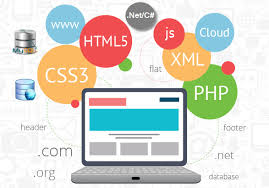

# CFGS Desarrollo de Aplicaciones Web

|  DAW/DWES Tema2 |
| :-----------:|
||
| INSTALACIÓN, CONFIGURACIÓN Y DOCUMENTACIÓN DE ENTORNO DE DESARROLLO Y DEL ENTORNO DE EXPLOTACIÓN |

- [1. Servidor de Desarrollo](ServidorDeDesarrollo.md)
- [2. Cliente de Desarrollo](ClienteDeDesarrollo.md)
- [3. GitHub](Git.md)
- [4. Entorno de Explotación](EntornoDeExplotacion.md)
---

> **Jesús Temprano Gallego**  
> Curso: 2025/2026  
> 2º Curso CFGS Desarrollo de Aplicaciones Web  
> Despliegue de aplicaciones web
